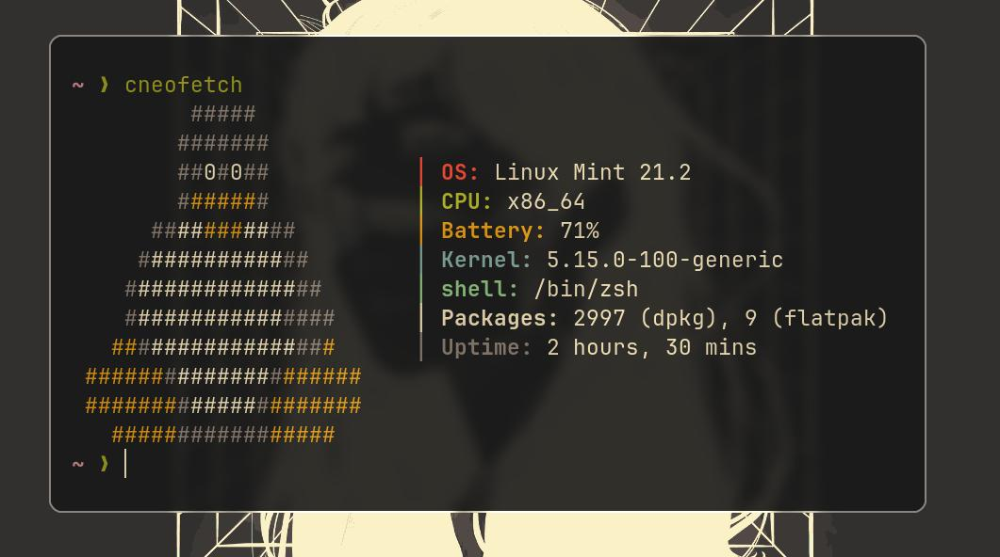

my fork of suckless simple terminal (st)

st-angel uses a config file located at ~/.config/st/st.conf
in this config file you can define fonts and colors to be used
so you can modify the program on the fly without compiling each time you
want to change your colorscheme.
take a look at st.conf.example 

is this against the suckless philpospy? 
yes but i dont care, i took it as a personal project
plus i like changing the colorscheme and fonts without compiling the source each time.


## Preview




## installation
```sh
git clone https://github.com/whiteapolo/st
cd st-angel
sudo make clean install
```

## run st
```sh
st
```

## Scrolling
PageUp to scroll up
PageDown to scroll down
you can also scroll with the mouse

## Zoom
zoom-in:     ctrl + plus
zoom-out:    ctrl + underscore
