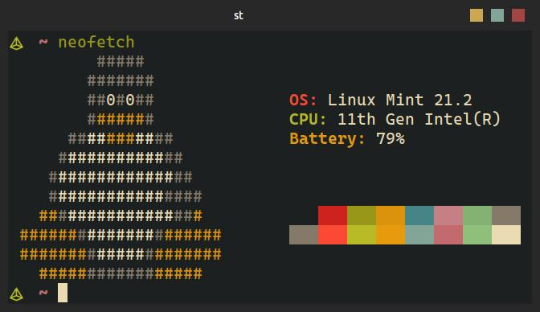
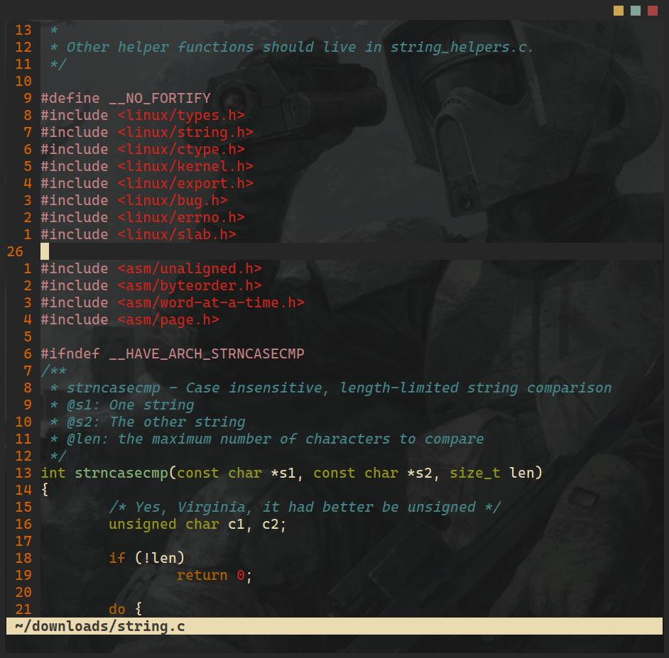

my fork of suckless simple terminal (st)


## Preview


<p float="center">
  
  
</p>


## installation
```
git clone https://github.com/whiteapolo/st
cd st
sudo make clean install
```

## run st
```
st
```

## notes
The font I use is CascadiaCode. 
if you want to use this font you will have to download CascadiaCode.tff and put it in /usr/share/fonts

if you want to use another font you can just change the font name in config.h 
```
static char *font = "CascadiaCode:pixelsize=20:antialias=true:autohint=true";
```

if you **want** to use your **system defualt** font than:
in config.h change the line:
```
static char *font = "CascadiaCode:pixelsize=20:antialias=true:autohint=true";
```
to: 
```
static char *font = "mono:pixelsize=22:antialias=true:autohint=true";
```
than exit and type: 
```
sudo make clean install
```
